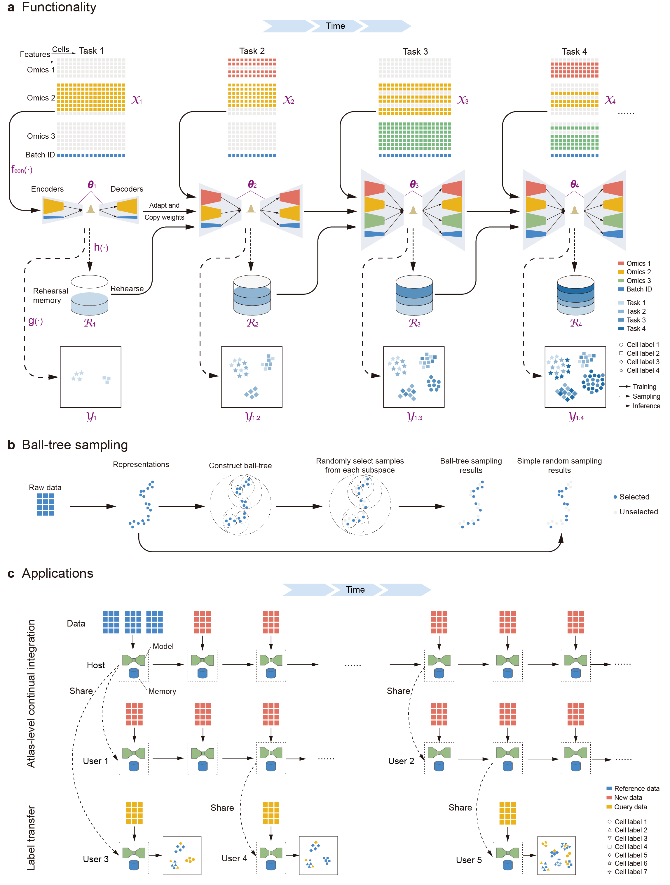

MIRACLE Documentation
=====================

MIRACLE is a continual integration framework for single-cell multimodal data.

Core Capabilities
-----------------

* Continual multimodal integration across sequential tasks and data releases.
* Replay memory construction for preserving previously learned biological
  structure during incremental updates.
* Feature alignment when new measurements add genes, proteins, peaks, or other
  modality-specific variables.
* Checkpoint loading, compatible parameter transfer, and latent extraction for
  downstream Scanpy/MuData workflows.

.. toctree::
   :maxdepth: 2
   :caption: Contents:

   installation.md
   quick_start.rst
   ./tutorials/tutorial_index.rst
   ./modules/modules_index.rst
   release.md
